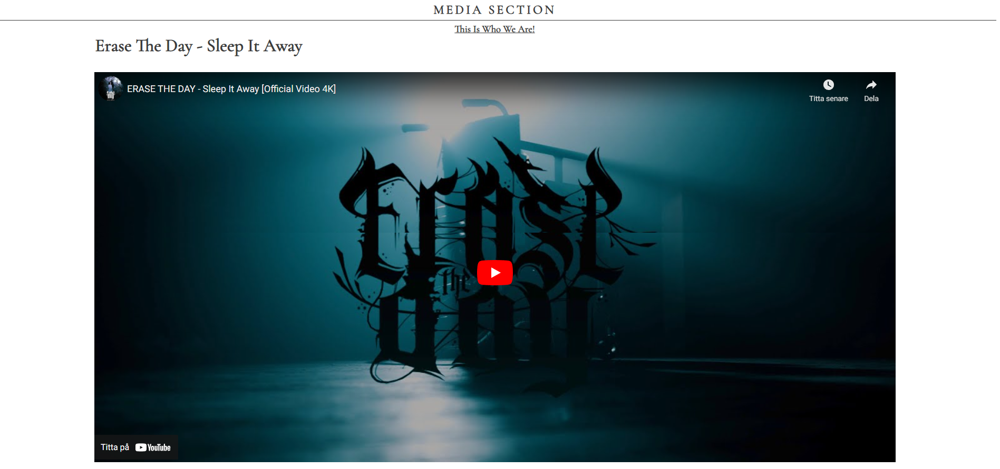

# Erase The Day First HTML/CSS PROJECT
In this project i wanted to make a fresh website for my personal band called [Erase The Day](https://www.facebook.com/ETDSWEDEN).

With this project i wanted to accomplish a clean easy way to use and navigate in out website for our audiance. The website is easy to navigate and makes everything very clear and simple for the users and user understanding and experience. 

# Features

- ### Navigation bar

   - Featured at the top right of the page is a navigation bar with a menu with 4 diffrent links, Home, About, Media and lastly a Contact form.

    - This section will allow the user to easily navigate from the top of the page navigation menu across all devices. Just touch or press, click ect and the bar with navigate you to your page destination.
    
   

- ### The Header Image 
  - The main image dose not have much to it, mostly a high quality photo as for eye candy.

  

-  ### About Band Section
   - This section just includes some minor information about the group. This is supposed to rise interest for our audiance and give them some background information about us.

   - Music From The Heart, were we get out insperation and how we use our arteristics.
   - Were We Come From, some minor info about were we are from ect ect.

    

- ### Media Section
  - In this section i have provided a h3 were i indicate who we are. And the media section is a part of the page were the audiance can navigate down through some video content.

   - I have added external links to the media section were you can select 3 of the bands videos to view. 
    - This is also adjusted so the selected video play's on the page and dosn't send you to an external page.

    

- ### Contact / Get in touch section
  - In this section of the page, i have provided a contact form for any user that wishe's to make contact to the artist in anyway.

   - The form is big and clear. The ide for the wide radius of the contact form is suppost to have the function to make it easy to find and easy to apply any info or inputs to the fields.

   

- ### Footer/Social Media section

  - At the bottom of the page i have created a footer with some social media option.
  
   - These icons are optimzed for a easy eye view.
  
   - Upon clicking the selected icon, you will be navigated to a new page. These have a blank taget so you wont have to close the current page or be moved elsewere.

   ![This is an image]

   # Testing